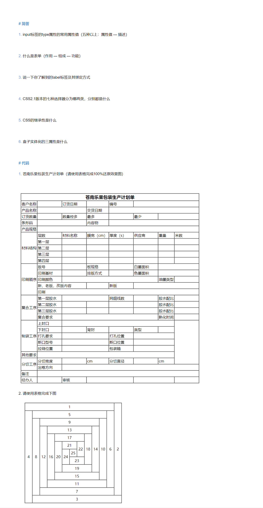

###简答

#####1. input标签的type属性的常用属性值（五种以上：属性值 --- 描述）
```
 1. text  单行文本输入
 2. password 密码输入
 3. radio 单选框
 4. checkbox 复选框
 5. button 普通按键
 6. reset 重置键
 7. submit 提交键
```
#####2.什么是表单（作用 --- 组成 --- 功能）
```
  作用：表单是用来收集用户输入信息的。
  组成：一个完整的表单通常由表单域、 提示信息和表单控件（也称为表单元素）3个部分构成。
  功能：
  * 表单域： 相当于一个容器， 用来容纳所有的表单控件和提示信息，可以通过他定义处理表单数据所用程序的url地址， 以及数据提交到服务器的方法。 如果不定义表单域，表单中的数据就无法传送到后台服务器。
  * 提示信息： 一个表单中通常还需要包含一些说明性的文字， 提示用户进行填写和操作。
  * 表单控件： 包含了具体的表单功能项， 如单行文本输入框、 密码输入框、 复选框、 提交按钮、 重置按钮等。
```
#####3. 说一下你了解到的label标签及其绑定方式
```
  所有的表单元素都可以通过绑定其他内容去扩大触发点击范围， 这时需要使用一个<label>标签。如果将表单控件与提示内容使用<label>进行绑定后， 当用户鼠标点击<label>内的提示内容时， 浏览器就会自动将焦点转到和标签相关的表单控件上。
 绑定方式：
  方式一 1.给表单元素设置id属性。
        2.然后将需要绑定的其他内容用<label>标签包裹。
        3.给<label>标签设置for属性， 属性值为绑定的表单元素的id属性值。
        <input type="checkbox" name="hobby" id="sport" />
        <label for="sport">运动</label>
  方式二：
        如果绑定内容和表单元素写在一起， 可以化简绑定写法。
        直接使用<label>标签将绑定内容与表单元素一起进行嵌套。
        <label><input type="radio" name="sex" />男</label>
```
#####4. CSS2.1版本的七种选择器分为哪两类，分别都是什么
```
  基础选择器： 标签选择器、 id 选择器、 类选择器、 通配符选择器。
  高级选择器： 后代选择器、 交集选择器、 并集选择器
```
#####5. CSS的继承性是什么
```
  • 如果一个标签没有设置过一些样式， 它的某个祖先级曾经设置过， 在浏览器中该标签也加载了这些样式， 这些样式都是从祖先级继承而来， 这种现象就是继承性。
  • 能够被继承的样式是所有的文字相关样式属性， 其他的属性都不能被继承
```
#####6. 盒子实体化的三属性是什么
```
  width heigth background-color,设置盒子的宽、高和背景颜色
```
###代码



#####1. 苍南乐果包装生产计划单

```html
<!DOCTYPE html>
<html lang="en">
<head>
  <meta charset="UTF-8">
  <meta http-equiv="X-UA-Compatible" content="IE=edge">
  <meta name="viewport" content="width=device-width, initial-scale=1.0">
  <title>苍南乐果包装生产计划单</title>
  <style>
    td {
        width: 72px;
    }
    .cengshu {
            width: 116px;
    }
  </style>
</head>
<body>
   <table border="1" style="border-collapse: collapse;">
      <!-- 表格的四个分区，
      <caption></caption> 表格的标题
      <thead></thead> 表格的头部，加粗线部分，内部嵌套tr>th
       <tbody></tbody>表格主要区域，内部嵌套tr>td
      <tfoot></tfoot>表格的页脚，内部嵌套tr>td -->
      <thead>
        <tr>
          <th colspan="8">苍南乐果包装生产计划单</th>
        </tr>
      </thead>
      <tbody>
        <tr>
          <td>客户名称</td>
          <td></td>
          <td>订货日期</td>
          <td></td>
          <td>编号</td>
          <td colspan="3"></td>
        </tr>
        <tr>
          <td>产品名称</td>
          <td colspan="2"></td>
          <td>交货日期</td>
          <td colspan="4"></td>
        </tr>
        <tr>
          <td>订货数量</td>
          <td></td>
          <td>数量控多</td>
          <td>最多</td>
          <td></td>
          <td>最少</td>
          <td colspan="2"></td>
        </tr>
        <tr>
          <td>条形码</td>
          <td colspan="2"></td>
          <td>内容物</td>
          <td colspan="4"></td>
        </tr>
        <tr>
          <td>产品规格</td>
          <td colspan="7"></td>
        </tr>
        <tr>
          <td rowspan="5">材料结构</td>
          <td class="cengshu">层数</td>
          <td>材料名称</td>
          <td>膜宽(cm)</td>
          <td>厚度(s)</td>
          <td>供应商</td>
          <td>重量</td>
          <td>米数</td>
        </tr>
        <tr>
          <td class="cengshu">第一层</td>
          <td></td>
          <td></td>
          <td></td>
          <td></td>
          <td></td>
          <td></td>
        </tr>
        <tr>
          <td class="cengshu">第二层</td>
          <td></td>
          <td></td>
          <td></td>
          <td></td>
          <td></td>
          <td></td>
        </tr>
        <tr>
          <td class="cengshu">第三层</td>
          <td></td>
          <td></td>
          <td></td>
          <td></td>
          <td></td>
          <td></td>
        </tr>
        <tr>
          <td class="cengshu">第四层</td>
          <td></td>
          <td></td>
          <td></td>
          <td></td>
          <td></td>
          <td></td>
        </tr>
        <tr>
          <td rowspan="5">印刷顺序</td>
          <td class="cengshu">版号</td>
          <td></td>
          <td>板规格</td>
          <td></td>
          <td>白墨面积</td>
          <td colspan="2"></td>
        </tr>
        <tr>
          <td class="cengshu">印刷基材</td>
          <td></td>
          <td>排版方式</td>
          <td></td>
          <td>色墨面积</td>
          <td colspan="2"></td>
        </tr>
        <tr>
          <td class="cengshu">印刷颜色</td>
          <td colspan="4"></td>
          <td>油墨类型</td>
          <td></td>
        </tr>
        <tr>
          <td class="cengshu" colspan="2">新，老版，改版内容</td>
          <td></td>
          <td>新版</td>
          <td colspan="3"></td>
        </tr>
        <tr>
          <td colspan="7">印刷</td>
        </tr>
        <tr>
          <td rowspan="4">复合工序</td>
          <td class="cengshu">第一层胶水</td>
          <td colspan="2"></td>
          <td>网锟线数</td>
          <td></td>
          <td>胶水配比</td>
          <td></td>
        </tr>
        <tr>
          <td class="cengshu">第二层胶水</td>
          <td></td>
          <td></td>
          <td></td>
          <td></td>
          <td>胶水配比</td>
          <td></td>
        </tr>
        <tr>
          <td class="cengshu">第三层胶水</td>
          <td></td>
          <td></td>
          <td></td>
          <td></td>
          <td>胶水配比</td>
          <td></td>
        </tr>
        <tr>
          <td class="cengshu">复合要求</td>
          <td colspan="4"></td>
          <td>熟化时间</td>
          <td></td>
        </tr>
        <tr>
          <td rowspan="5">制袋工序</td>
          <td class="cengshu">上封口</td>
          <td colspan="5"></td>
          <td rowspan="7"></td>
        </tr>
        <tr>
          <td class="cengshu">下封口</td>
          <td></td>
          <td>背封</td>
          <td></td>
          <td>类型</td>
          <td></td>
        </tr>
        <tr>
          <td class="cengshu">打孔要求</td>
          <td colspan="2"></td>
          <td>打孔位置</td>
          <td colspan="2"></td>
        </tr>
        <tr>
          <td class="cengshu">斯口型号</td>
          <td colspan="2"></td>
          <td>斯口位置</td>
          <td colspan="2"></td>
        </tr>
        <tr>
          <td class="cengshu">拉链位置</td>
          <td colspan="2"></td>
          <td>包装箱</td>
          <td colspan="2"></td>
        </tr>
        <tr>
          <td>其他要求</td>
          <td colspan="6"></td>
        </tr>
        <tr>
          <td rowspan="2">分切工序</td>
          <td>分切宽度</td>
          <td></td>
          <td>cm</td>
          <td>分切直径</td>
          <td></td>
          <td>cm</td>
        </tr>
        <tr>
          <td>出卷方向</td>
          <td colspan="6"></td>
        </tr>
        <tr>
          <td>备注</td>
          <td colspan="7"></td>
        </tr>
        <tr>
          <td>经办人</td>
          <td></td>
          <td>审核</td>
          <td colspan="2"></td>
          <td colspan="2"></td>
          <td></td>
        </tr>
      </tbody>
  </table>
</body>
</html>

```
#####2. 请使用表格完成下图
```html
<!DOCTYPE html>
<html lang="en">
<head>
  <meta charset="UTF-8">
  <meta http-equiv="X-UA-Compatible" content="IE=edge">
  <meta name="viewport" content="width=device-width, initial-scale=1.0">
  <title>表格图</title>
  <style>
    td{
      width: 24px;
      height: 24px;
      text-align:center;
    }
  </style>
</head>
<body>
    <table border="1" style="border-collapse: collapse;">
        <tr>
          <td colspan="12">1</td>
          <td rowspan="12">2</td>
        </tr>
        <tr>
          <td rowspan="12">4</td>
          <td colspan="10">5</td>
          <td rowspan="10">6</td>
        </tr>
        <tr>
          <td rowspan="10">8</td>
          <td colspan="8">9</td>
          <td rowspan="8">10</td>
        </tr>
        <tr>
          <td rowspan="8">12</td>
          <td colspan="6">13</td>
          <td rowspan="6">14</td>
        </tr>
        <tr>
          <td rowspan="6">16</td>
          <td colspan="4">17</td>
          <td rowspan="4">18</td>
        </tr>
        <tr>
          <td rowspan="4">20</td>
          <td colspan="2">21</td>
          <td rowspan="2">22</td>
        </tr>
        <tr>
          <td rowspan="2">24</td>
          <td>25</td>
        </tr>
        <tr>
          <td colspan="2">23</td>
        </tr>
        <tr>
          <td colspan="4">19</td>
        </tr>
        <tr>
          <td colspan="6">15</td>
        </tr>
        <tr>
          <td colspan="8">11</td>
        </tr>
        <tr>
          <td colspan="10">7</td>
        </tr>
        <tr>
          <td colspan="12">3</td>
        </tr>
    </table>
</body>
</html>
```
