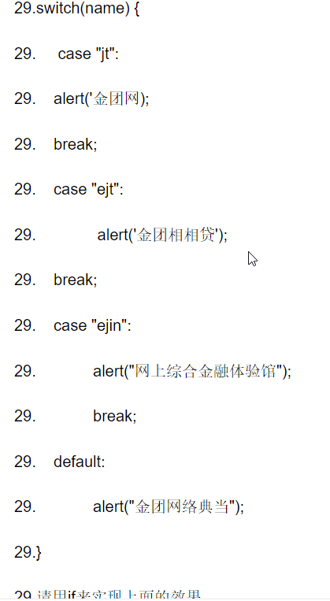

####1. 请写出两种将Javascript应用到网页的方式 
``` 
网页、网站、应用程序
```
####2.       如何定义一个变量？变量的命名规则有哪些？
```
定义方法：使用一个 var 的关键字进行定义，后面必须加一个空格，空格后面自定义变量名。
规则:必须遵守的，不遵守会报错
    由字母、数字、下划线、 $ 符号组成，不能以数字开头。
    字母区分大小写， A 和 a 表示不同。
    不能是关键字和保留字，关键字指的是js中有特殊功能的小词语，比如 var、 for 等；
    保留字指的是现在没有特殊功能，但是将来新语法中有可能作为关键字使用。
```
####3.       == 和 === 的区别
```
== 相等，只判断值大小是否相等，不判断数据类型;
=== 全等，不光判断值相等，还要判断数据类型相等。
```
#### 4.JS的简单数据类型有哪些并简单描述
```
    • Number 数字类型
    • String 字符串类型
    • undefined undefined 类型
    • Boolean 布尔类型
    • null null 类型
```
####5.       JS的算数运算符有哪些
```
    • + - * / % ()
    • %:取余，取模。 a / b = c 余 d，就说a % b = d。
    • 运算顺序：先算乘除取余、再算加减，有小括号先算小括号。
```
####6.       JS的比较运算符有哪些
```
> 大于
< 小于
>= 大于等于
<= 小于等于
== 相等，只判断值大小是否相等，不判断数据类型
!= 不等，与相等完全相反
=== 全等，不光判断值相等，还要判断数据类型相等
!== 不全等，与全等于完全相反
```
####7.       JS的逻辑运算符有哪些
```
&& 逻辑与运算符 且
|| 逻辑或运算符
! 逻辑非运算符
```
####8.       var i = 100; i++; j = i++;y = ++j;请问j和y分别是多少
```
102 102
```
####9.       计算下列算式，并将结果输出：

```
-2146.084282460137
```
####10.   住房公积金缴纳金额与工资两者的关系是：住房公积金 = 税前工资 * 0.1* 2 ;编写程序，让用户输入税前工资，弹出对应的公积金数额。
```JavaScript
var num = parseFloat(prompt("请输入输入税前工资",num));
var moneyNum = num *0.1 * 2;
prompt("公积金数额",moneyNum);
```
####11.   用JS计算下列算式，并将结果在弹出：

```JavaScript
var a = 23, b = 5, c= 45,sum = null;
 sum = ((a+(b*b*b*b*b*b*b))/45)*((a+(b*b*b*b*b*b*b))/45);

sum = 3015856.7427160493

```
#### 12.   编写程序，提示用户输入圆锥的底面半径和高，然后弹出它的体积，计算圆锥体积的公式是：
#####体积V=1/3π半径2*高
```
var r = parseFloat(prompt("请输入圆锥的底面半径",r));
var h = parseFloat(prompt("请输入圆锥的高",h));
var v = (1/3)*3.14*r*r*h;
alert("圆锥体积"+v);
```
####13.   如果今天是星期二，那么1000天后是星期几？用户输入一个天数，计算这个天数后是星期几。
```JavaScript
    var today = parseInt(prompt("请输入今天是星期几","2"));
    var day = parseInt(prompt("请输入一个任意整数天数","1000"));

    var future = (today + day) % 7;
    if(future == 0){
            future = 7;
    }

    alert("星期"+today+"的"+day+"天之后是星期" + future);
```
####14.   用户输入一个三位数，弹出各个数位的和。
```JavaScript
        var num = parseInt(prompt("输入一个三位数"));
        var sum = null;
        var ge = num % 10;
        var shi = parseInt((num/10))%10;
        var bai = parseInt((num/100))%10;
        sum = ge + shi + bai;
        alert("各个数位的和:" + sum);
```
####15.用户输入一个数字，然后判断这个数字能否被5、6整除的情况，根据情况弹出下面4种警告框：
```JavaScript
    var num = parseInt(prompt("输入一个数字"));
        if (num % 5 == 0){
            if (num % 6 == 0) {
                alert("这个数同时能被5和6整除");
            }else{
                alert("这个数能被5整除，但是不能被6整除");
            }
        }else{
            if (num % 6 == 0) {
                alert("这个数能被6整除，但是不能被5整除");
            }else{
                alert("这个数既不能被5整除，也不能被6整除");
            }
        }
```
####16.   用户输入一个数字，然后再输入一个数字。然后弹出警告框：

```JavaScript
     var num1 = parseInt(prompt("请输入一个数字"));
        var num2 = parseInt(prompt("请再输入一个数字"));
        if ((num1 % 2 == 0 ) && (num1 % 3 == 1 )){            
                alert("你好，这两个数字的奇偶性相同");
        }else{
            alert("你好，这两个数字的奇偶性不同");
        }
```
####17.  用户输入一个年份，判断这个年是否是闰年。
```
判断闰年条件：

① 非整百年数除以4，无余为闰，有余不闰；

② 整百年数除以400，无余为闰，有余不闰。

比如：

2000年，整百数年，就要用②公式，除以400，无余数，所以是闰年。

1900年，整百年数，就要用②公式，除以400，有余数，所以不是闰年。

2100不是
……

2016
2012
2008
2004
2000

……

……

1904

1900不是


自己把中文判断条件转为计算机语言。
```
```JavaScript
   var num1 = parseInt(prompt("请输入一个年份","2004"));        
        if ((num1 % 4 == 0 &&  num1 % 100 != 0) || num1 % 400 == 0){            
                alert(num1+"是闰年");
        }else{
            alert(num1+"不是闰年");
        }
```
####18.   推导循环执行的顺序，用文字进行说明，并推导出可能的结果。

 ```
  for(var m = 1,n = 2; m + n < 25; m++){
       n += 3;
       console.log(m);

  }
 ```
 ```
 1 2 3 4 5 6 
 ```
 #### 19.   推导循环执行的顺序，用文字进行说明，并推导出可能的结果。

             for(var i = 30 ; i > 5 ; i -= 7){

                     console.log(i--);

              }
```
30
22
14
6    
```          
#### 20.   用户输入一个数字n，计算1+2+3+4+……n的和。
```JavaScript
    var n = parseInt(prompt("请输一个数字n","2004"));        
        var sum = 0;
        for(var i = 1; i < n; i++){
            sum += i;
        }
      alert("1+2+3+4+……n的和为: "+sum);
```
#### 21.   用户输入一个整数n，计算n的阶乘。即n*(n-1)*(n-2)*……*3*2*1.
```JavaScript
    var n = parseInt(prompt("请输一个数字n","2004"));        
        var sum = 1;
        for(var i = n; i >=1; i--){
            sum *= i;
        }
      alert("n的阶乘为: "+sum);

```
#### 22.   用户输入一个数字n

计算   
```JS
     var n = parseInt(prompt("请输一个数字n","2004"));        
        var sum = 0;
        for(var i = 2; i < n+1; i++){
            sum += (i+1)/i;
        }
      alert("和为: "+sum);
```
#### 23.   用户输入一个数字，在控制台中列出它的所有约数。
```JS
var n = parseInt(prompt("请输一个数字n","20"));        
        var sum = 0;
        for(var i = 1; i <= n; i++){
            if (n % i ==0) {
                console.log(i)
            }
        }
      
```
#### 24.   水仙花数是一种特殊的四位数，它的特点就是，每个数位的四次方和，等于它本身。请编程找出来
```JS
    for(var i = 1; i <= 9999; i++){
        
        var ge = i%10;
        var shi = parseInt((i/10))%10;
        var bai = parseInt((i/100))%10;
        var qian = parseInt((i/1000))%10;
        var sum = Math.pow(ge,4)+ Math.pow(shi,4)+ Math.pow(bai,4)+ Math.pow(qian,4);
        if (sum == i)
        console.log(i);
    }
```
#### 25.   如果一个数恰好等于它的约数之和，则称该数为“完美数”。

例如：

第1个完全数是6，它有约数1、2、3、6，除去它本身6外，其余3个数相加，1+2+3=6。第2个完全数是28，它有约数1、2、4、7、14、28，除去它本身28外，其余5个数相加，1+2+4+7+14=28。

试寻找1~10000之间的所有完美数。
``` JS
        for(var i = 1; i <= 10000; i++){
            var sum = 0;
            for(let j = 1; j<= i; j++) {
                if ( i%j == 0){
                    if (j != i)
                    sum +=j;
                    // console.log(j);
                } 
            }
            if( sum == i) {
                console.log(i);
            }
        }
```
#### 26.   用户输入一个数字，判断这个数字是否是质数。

质数就是指它的约数只有1和它本身。看约数个数是否是2.
```JS
    var n = parseInt(prompt("请输一个数字n","20"));  
    var num = 0;
    for(var i = 1; i <= n; i++){    
            if ( n%i == 0){
                num ++;
            }             
    }
    if( num == 2) {
            alert(n+"是质数！");
    }
    else {
        alert(n+"不是质数！");
    }
```
#### 27.   列出1~10000的所有质数。
```js
    for(var j = 1; j <= 10000; j++){ 
          var num = 0;   
          for(var i = 1; i <= j; i++){    
                if ( j%i == 0){
                   num ++;
                }                             
          }
          if( num == 2) {
              console.log(j+"是质数！");
            }                     
        }
```
#### 28.   苹果3元一个，鸭梨2元一个，桃子1元一个。现在想用200元正好买100个水果，在控制台中列出所有可能性。
```JS
    for(var apple = 0;apple <= 100;apple++){
            for(var pears = 0;pears <= 100;pears++){
                for(var peach = 0;peach <= 100;peach++){
                    if(3*apple+2*pears+1*peach == 200 && apple+pears+peach == 100){
                        console.log("苹果"+apple+"个，","鸭梨"+pears+"个，","桃子"+peach+"个");
                    }
                }
            }
        }
```
#### 29.   有这样一个代码 
```JS
    var wordsString = prompt("请输一个字符串")+""; 
        if (wordsString == "jt"){
          alert(`金团网`);
        }else if (wordsString == "ejt"){
          alert(`金团相相贷`);
        }else if (wordsString ==`ejin`) {
          alert(`网上综合金融体验馆`);          
        }else{
          alert(`金团网络典当`);
        }
```
#### 30.   JS有几种循环，分别是什么
```
    for循环、do while循环 、while循环
```
#### 31.   break和continue的区别是什么
```
    break 语句的作用可以立即停止当前的 for、 do while、 while 循环。
    遇到 continue 表示当前的一次循环数据不是我们想要的，会立即停止当前次的循环，立
    即进入下一次循环
```
#### 32.   请用循环计算出 1+2+3+4+5+...+100   的值
```JS
   
        var sum = 0;
        for(var i = 1; i < 100; i++){
            sum += i;
        }
      alert("1+2+3+4+……n的和为: "+sum);
```
#### 34
```JS
    var grade = parseInt(prompt("请输入分数"));
        if (grade < 60){
          alert("你的成绩等级为不及格，继续加油哦！");
        }else if (grade < 90){
          alert("你的成绩等级为良好");
        }else{
          alert("你的成绩等级为优秀");
        }
```
#### 35.   输入月份，显示当月天数（输入2月时需要再次输入年份判断是不是闰年后在显示当月天数）
```JS
    var month = parseInt(prompt("请输入月份"));
       var year = parseInt(prompt("请输入年份"));
        //month是字符串类型需要进行类型转换;
       switch( month ){
           case 1 : 
           case 3 : 
           case 5 : 
           case 7 : 
           case 8 : 
           case 10 : 
           case 12 : 
               alert("31天");
               break;
           case 4:
           case 6:
           case 9:
           case 11:    
               alert("30天");
               break;
           case 2:
                  //2月要考虑闰年 
               if(year % 4 === 0 && year % 100 !== 0 || year % 400 === 0){
                   alert("29天");
               }else{
                   alert("28天");
               }
       }
```